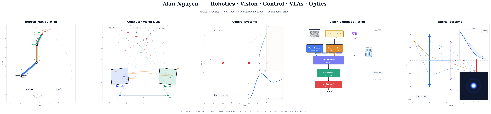

  

<h1 align="center">Nguyen Khoi Nguyen (Alan)</h1>

  <strong>Physics + Computer Science @ Boston University</strong> 
  Computational physics, photonics, embodied AI, robotics

  
  
  

### Background

Bachelor's in Physics and Computer Science (dual degree) from Boston University. Research background in **computational optical physics**: intensity diffraction tomography, Fourier optics, FDTD photonic device simulation, and cavity quantum electrodynamics. Coursework and research spanning condensed matter theory, nano-optics, and quantum engineering.

Now building at the intersection of **physical AI and robotics**: language-conditioned manipulation, VLM/VLA-to-robot execution, and real-time multi-model orchestration for physical task guidance.

### Languages and Tools

  
  
  
  
  
  
  
  

  
  
  
  
  
  
  
  

  
  
  
  
  
  
  
  

---

### What I Work On

**Robotics + Embodied AI**  
Language-conditioned manipulation pipelines on a 7-DoF Sawyer arm. VLM/VLA inference mapped to hierarchical ROS2 action execution. Perception stack: RGB-D point clouds, open-vocabulary segmentation, 6-DoF pose estimation, scene graph construction. Sim-to-real transfer via Isaac Sim with domain randomization.

**Computational Physics + Photonics**  
Intensity diffraction tomography (reflection-IDT with novel transfer function derivations). Fourier optics simulation (angular spectrum method, vectorial diffraction). FDTD photonic device design (Tidy3D: directional couplers, loop mirrors, waveguide analysis). Cavity QED simulations: Jaynes-Cummings dynamics, Wigner function evolution, Lindblad master equation.

**Physical AI**  
Building [Clanq.ai](https://clanq.ai): real-time multi-model orchestration (Claude/GPT-4o/Gemini) for physical task guidance, starting with appliance repair. On-device frame sampling, RAG domain knowledge engine, Thompson sampling model routing.

---

### Selected Repositories

| Repository | Description |
|-----------|-------------|
| [QSOL_CQED](https://github.com/alanknguyen/QSOL_CQED) | Computational cavity QED: Wigner function dynamics, entanglement entropy, and decoherence in the Jaynes-Cummings model. QuTiP simulations, REVTeX manuscript. |
| *More repositories pinned below.* | |

---

### Research + Publications

**Quantum States of Light in Cavity QED** (2025, arXiv submission in progress)  
Computational study of Schrodinger cat-state formation, atom-field entanglement dynamics across four field states, and decoherence via the Lindblad master equation. [Code](https://github.com/alanknguyen/QSOL_CQED)

**Reflection-Mode Intensity Diffraction Tomography** (BU, 2024)  
Extended IDT to reflection geometry with mirror-assisted illumination. Derived new optical transfer functions for 3D refractive index reconstruction.

---

### Education

**M.S. Electrical & Computer Engineering (Systems Robotics)**, Boston University (starting Sept 2026)  
**B.S./B.A. Physics & Computer Science (Dual Major)**, Boston University (Dec 2025)

---

### Currently

- Embodied AI research at BU Dependable Computing Lab (DCL) and RASTIC
- Building Clanq.ai (targeting YC S26)
- Teaching Machine Vision (BUAIS CS 185)
- Co-founded BU AI Society
